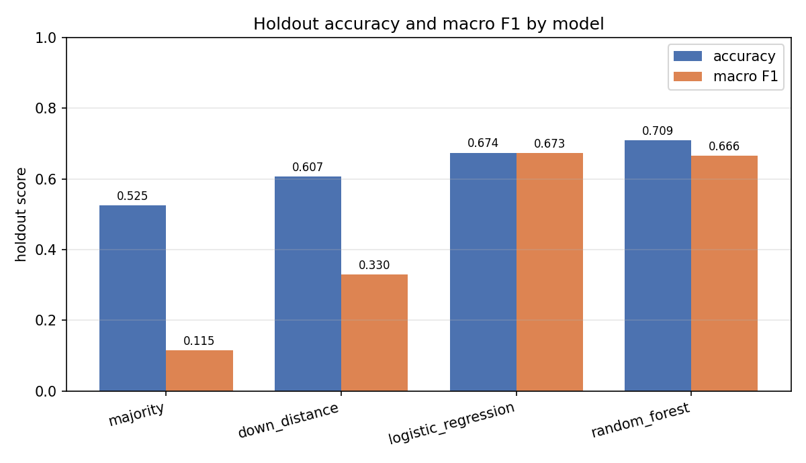
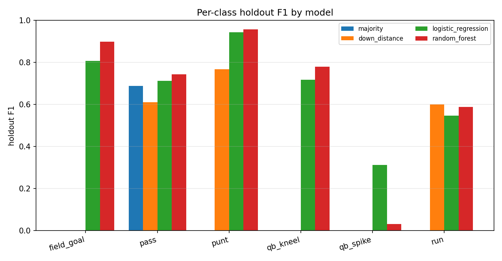
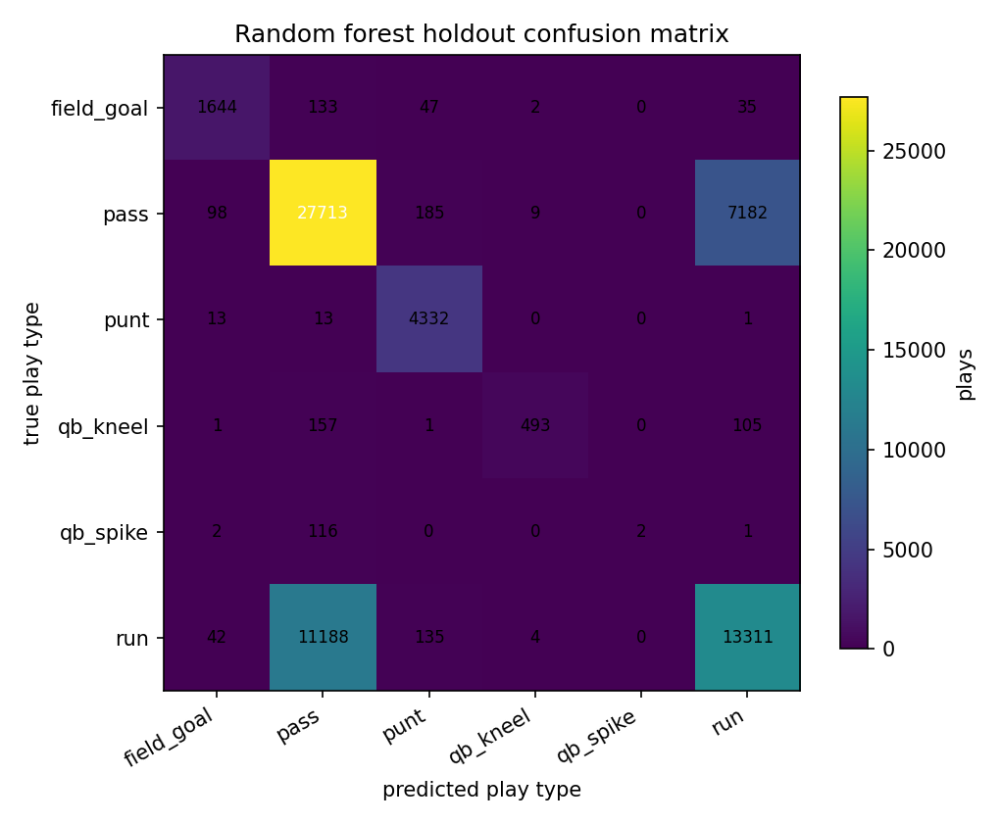

# Predicting NFL play types

This project classifies NFL play types with scikit-learn using information
available before the snap. It revisits a graduate course project from 2024
with new code and new measurements.

Jadon Calvert directed the 2026 implementation and documentation with AI
assistance. The new code corrects the original experiment's row-level leakage,
previous-play shifts across game boundaries, and post-play inputs. It does not
copy the coursework files and is not a production system.

## Objective

The target is one of six recorded play types: `field_goal`, `pass`, `punt`,
`qb_kneel`, `qb_spike`, or `run`. Inputs include down, distance, field position,
clock, timeouts, score, teams, and the preceding play in the same game.

The models train on the 2009 through 2016 seasons and are evaluated once on
the 2017 and 2018 seasons. The split keeps games intact and measures performance
on later seasons. Imputation and scaling learn from training rows only.
Previous-play yardage, play type, and clock context come from the same game.
The models do not use the current play's outcome.

## Measured results

Training used 288,530 plays from 2,045 games dated 2009-09-10 through 2017-01-01.
The holdout contains 66,965 plays from 480 games dated 2017-09-07 through
2018-12-17. The date cutoff is 2017-09-01.

The table rounds values from [`results/metrics.json`](results/metrics.json)
to four decimal places.

| Model | Accuracy | Macro-F1 |
| --- | ---: | ---: |
| `majority`, class-prior baseline | 0.5255 | 0.1148 |
| `down_distance`, down/distance baseline | 0.6069 | 0.3297 |
| `logistic_regression` | 0.6741 | **0.6734** |
| `random_forest` | **0.7093** | 0.6663 |

Passes account for 52.5% of the holdout. Predicting `pass` for every row gives
the majority baseline 0.5255 accuracy, but zero F1 on the other five classes
and 0.1148 macro-F1.

The random forest has higher accuracy than logistic regression, but lower
macro-F1. It identifies 2 of 121 `qb_spike` plays, with recall 0.0165,
precision 1.0, and F1 0.0325. Logistic regression identifies 34 of 121, with
recall 0.2810 and F1 0.3134. Neither model leads on every class.
The experiment uses no probability calibration or threshold tuning.







The run uses seed 42, 200 trees, a maximum depth of 18, a minimum leaf size
of 5, and 2 jobs. See [`docs/experiment.md`](docs/experiment.md) for the
protocol, per-class support, and limitations, including uncalibrated
probabilities.

## Setup and checks

Install Python 3.12 and [uv](https://github.com/astral-sh/uv).

```bash
uv sync --locked
uv run ruff format --check .
uv run ruff check .
uv run pytest
uv run nfl-showcase smoke
```

`pytest` runs 59 tests on fictional fixtures. `smoke` checks the complete
workflow with generated fictional plays, without the NFL dataset.
Its scores do not measure performance on real NFL data.

The three self-contained examples are separate from the NFL package and run on
bundled or generated data:

```bash
uv run python examples/linear_regression.py --output-dir results/examples
uv run python examples/classification.py --output-dir results/examples
uv run python examples/clustering.py --output-dir results/examples
```

## Acquiring data and running the experiment

This repository does not distribute the NFL dataset. Download
*NFL Play by Play 2009-2018 (v5)* from
[Kaggle](https://www.kaggle.com/datasets/maxhorowitz/nflplaybyplay2009to2016).
Check its size and SHA-256 against [`docs/data.md`](docs/data.md), which also
documents acquisition and data rights.

The commands below use `data/NFL Play by Play 2009-2018 (v5).csv`.
Git ignores `data/`. Change the path if you keep the CSV elsewhere.

```bash
# Fit the four models and save the bundle and artifacts/training.json.
uv run nfl-showcase train \
  --data "data/NFL Play by Play 2009-2018 (v5).csv" \
  --exclude-ambiguous-games \
  --output-dir artifacts --holdout-start 2017-09-01 \
  --seed 42 --trees 200 --jobs 2

# Evaluate the saved bundle on its recorded holdout and write metrics and figures.
uv run nfl-showcase evaluate \
  --data "data/NFL Play by Play 2009-2018 (v5).csv" \
  --model artifacts/models.joblib \
  --output-dir results
```

This dataset requires `--exclude-ambiguous-games`. Cleaning removes 2,393
exact duplicates, then finds 22 conflicting play identifiers in one game.
The flag excludes all 268 rows of that game, leaving 446,710 of 449,371
raw rows. Without it, `train` rejects the conflicting records.
`evaluate` rejects a CSV whose SHA-256 differs from the training file.

## Predicting from pre-play context

`predict` uses the saved random forest to score hypothetical contexts.
It prints labels and probabilities:

```bash
uv run nfl-showcase predict --model artifacts/models.joblib --input examples/pre_play_context.json
```

[`examples/pre_play_context.json`](examples/pre_play_context.json) describes
a hypothetical play. Miami has the ball and trails Buffalo by 3. It is
2nd-and-4 at the Buffalo 38 with 5:00 left in the fourth quarter, after a
6-yard run that kept the clock running. The file contains all 16 required
inputs and is not a dataset row.

Supply every input column. The CLI does not invent missing game context.
JSON `null` passes a missing value to the imputer fitted during training.
Imputation does not recover the actual context of a game.
Prediction runs through the batch CLI, not a hosted or interactive widget.

## Repository layout

| Path | Contents |
| --- | --- |
| [`src/nfl_showcase/`](src/nfl_showcase/) | Feature engineering, models, and the `train`/`evaluate`/`predict`/`smoke` CLI. |
| [`docs/index.html`](docs/index.html) | Static report page over the measured results and figures. |
| [`docs/data.md`](docs/data.md) | Dataset source, verification, acquisition, and cleaning evidence. |
| [`docs/features.md`](docs/features.md) | Full pre-play feature audit and rejection list. |
| [`docs/experiment.md`](docs/experiment.md) | Protocol, split, metrics, historical comparison, limitations. |
| [`docs/provenance.md`](docs/provenance.md) | Authorship, rights, third-party licenses, data rights detail. |
| [`examples/`](examples/) | Three documented examples plus the sample inference context; see [`examples/README.md`](examples/README.md). |
| [`tests/`](tests/) | Original test suite on fictional fixtures. |
| [`results/`](results/) | Published aggregate metrics and figures. [`results/examples/`](results/examples/) contains example outputs. |
| [`LICENSE`](LICENSE) | MIT, scoped to this repository's original work. |

### Static report

The static report reads the published metrics and figures. It does not make
predictions. Serve it from the repository root so the relative paths to
`results/` work, then open `docs/`:

```bash
uv run python -m http.server 8000 --bind 127.0.0.1
# Open http://127.0.0.1:8000/docs/ in your browser.
```

## Provenance, rights, and license

The MIT [`LICENSE`](LICENSE) covers this repository's original code, tests,
documentation, examples, and aggregate results. The repository does not include
instructor material, 2024 notebooks or reports, photographs, or old models.
The 2026 work used AI assistance under Jadon Calvert's direction. It does not
claim that he wrote every line without assistance.

Raw NFL data, model bundles, and row-level extracts remain local. Kaggle lists
the dataset license as `Unknown`. Upstream rights are unresolved, and this
project claims none. See [`docs/provenance.md`](docs/provenance.md).

The reported 2024 micro-F1 of about 0.75 to 0.77 comes from a different protocol
with unresolved leakage. It is not comparable with the current results.
See the [historical comparison](docs/experiment.md#historical-2024-comparison-explicitly-not-comparable).

NFL and team names identify the dataset's contents. This project has no
NFL affiliation or endorsement.
